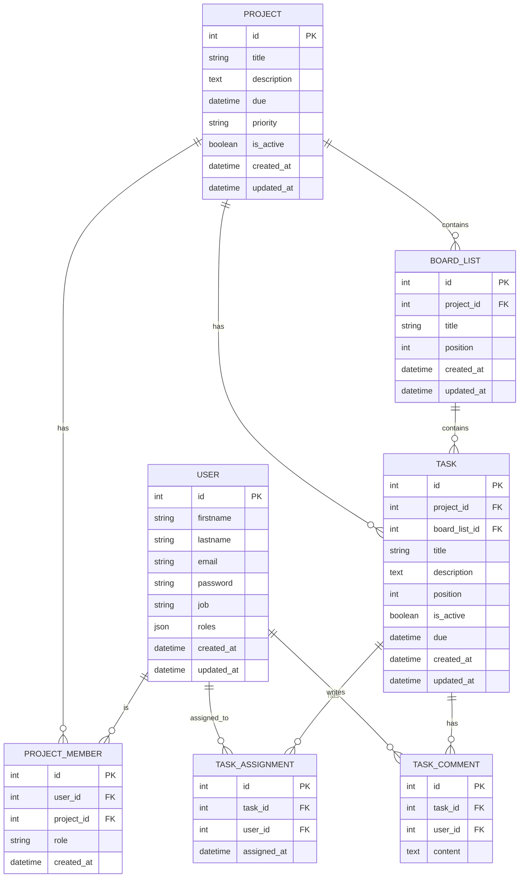

```mermaid
erDiagram

    USER {
        int id PK
        string firstname
        string lastname
        string email
        string password
        string job
        json roles
        datetime created_at
        datetime updated_at
    }

    PROJECT {
        int id PK
        string title
        text description
        datetime due
        string priority
        boolean is_active
        datetime created_at
        datetime updated_at
    }

    PROJECT_MEMBER {
        int id PK
        int user_id FK
        int project_id FK
        string role
        datetime created_at
    }

    BOARD_LIST {
        int id PK
        int project_id FK
        string title
        int position
        datetime created_at
        datetime updated_at
    }

    TASK {
        int id PK
        int project_id FK
        int board_list_id FK
        string title
        text description
        int position
        boolean is_active
        datetime due
        datetime created_at
        datetime updated_at
    }

    TASK_ASSIGNMENT {
        int id PK
        int task_id FK
        int user_id FK
        datetime assigned_at
    }

    TASK_COMMENT {
        int id PK
        int task_id FK
        int user_id FK
        text content
    }

    USER ||--o{ PROJECT_MEMBER : is
    PROJECT ||--o{ PROJECT_MEMBER : has

    PROJECT ||--o{ BOARD_LIST : contains
    BOARD_LIST ||--o{ TASK : contains

    PROJECT ||--o{ TASK : has

    TASK ||--o{ TASK_ASSIGNMENT : has
    USER ||--o{ TASK_ASSIGNMENT : assigned_to

    TASK ||--o{ TASK_COMMENT : has
    USER ||--o{ TASK_COMMENT : writes
```